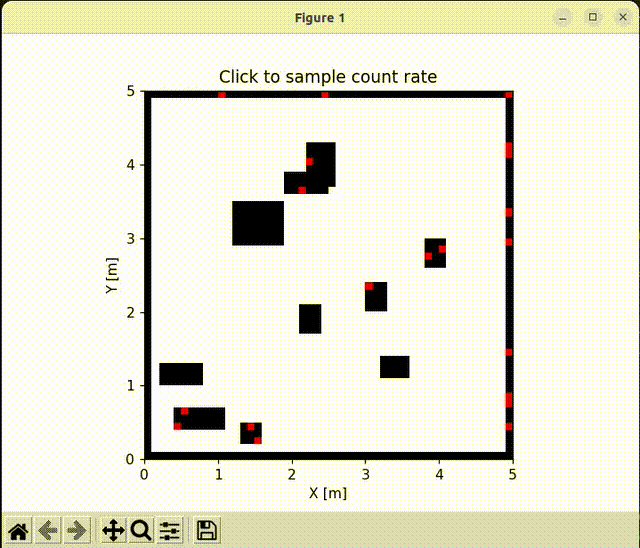
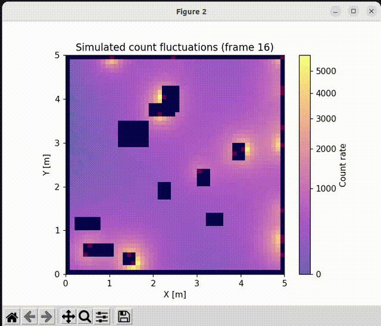

# radiation_source_localization_n_exploration

## Features
Attenuation is ignored.

## Radiation Count Model

Let the sensor be at position `(x_s, y_s, z_s)`, and the `j`-th radiation source at `(x_j, y_j, z_j)` with emission `I_j`. Let the sensor “radius” be `r_s`.

**Euclidean distance between sensor and source:**

$$
d_j = \sqrt{(x_s - x_j)^2 + (y_s - y_j)^2 + (z_s - z_j)^2}
$$

**Normalization factor:**

$$
I_c = 1 - \frac{1}{\sqrt{1 + r_s^2}}
$$

**Sensed fraction of the source:**

$$
\text{sensed ratio}_j = 1 - \frac{d_j}{\sqrt{d_j^2 + r_s^2}}
$$

**Expected count rate:**

$$
\lambda = \sum_{j=1}^{M} \frac{I_j}{I_c} \cdot \text{sensed ratio}_j
$$

**Observed count (Poisson sampling):**

$$
k \sim \text{Poisson}(\lambda)
$$

